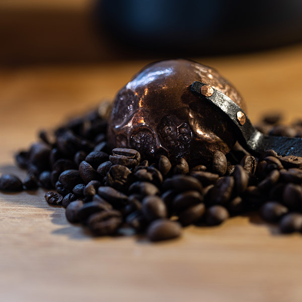

# Simplified Image File Structure (Single Size Per Image)

## 🎯 Simplified Approach: One Size Per Image

You're absolutely right! If you're not concerned about mobile bandwidth optimization, using **one optimized size per image** is much simpler and still works great. This is what you're already doing in many places on your site.

---

## ✅ Benefits of Single-Size Approach

1. **Simpler file management** - Only one file per image
2. **Less storage space** - No duplicate sizes
3. **Faster workflow** - Only need to prepare one image
4. **Easier maintenance** - Fewer files to manage
5. **Still looks good** - Modern browsers handle image scaling well

---

## 📁 Simplified Folder Structure

```
assets/images/
│
├── featured/                          # Mega-menu (3 items)
│   ├── item-01.jpg                   # Single size (600×600px)
│   ├── item-02.jpg
│   └── item-03.jpg
│
├── categories/                        # Category hero images
│   ├── copper-works.jpg              # Single size (1200×800px)
│   ├── weaving-tools.jpg
│   └── [category].jpg
│
└── products/                          # All product images
    ├── copper-works/
    │   ├── copper-spoons/
    │   │   ├── subcategory-preview.jpg  # Single size (800×800px)
    │   │   ├── copper-tea-spoon/
    │   │   │   ├── 01-main.jpg         # Single size (800×800px)
    │   │   │   ├── 02-detail.jpg       # Single size (800×800px)
    │   │   │   └── 03-side-view.jpg    # Single size (800×800px)
    │   │   └── [other-products]/
    │   └── copper-ladles/
    │       └── [same structure]
    └── [other-categories]/
```

---

## 📏 Recommended Single Sizes

### For Different Use Cases

| Image Type | Recommended Size | File Size Target | Notes |
|------------|------------------|------------------|-------|
| **Mega-Menu Featured** | 600×600px | 80-120 KB | Square, optimized |
| **Category Hero** | 1200×800px | 200-300 KB | Landscape, full-width |
| **Subcategory Preview** | 800×800px | 100-150 KB | Square, for cards |
| **Product Cards** | 800×800px | 100-150 KB | Square, listing pages |
| **Product Detail** | 1200×1200px | 200-300 KB | Square, gallery/main |

---

## 🎨 Simplified Naming Convention

### Before (Multiple Sizes)
```
01-main-small.jpg
01-main-medium.jpg
01-main-large.jpg
```

### After (Single Size)
```
01-main.jpg          # Use one optimized size (800×800px)
02-detail.jpg
03-side-view.jpg
```

**No size suffixes needed!** Just number your images.

---

## 💡 Smart Single-Size Strategy

Use **one optimal size** that works well for most displays:

### Option 1: Medium Size (Recommended)
- **800×800px** for product images
- **1200×800px** for hero images
- Works well on desktop and tablets
- Mobile browsers will scale it down (and they're good at it)
- **Best balance** of quality and file size

### Option 2: Large Size (Higher Quality)
- **1200×1200px** for product images
- **1920×1080px** for hero images
- Better for high-DPI displays
- Larger file sizes but better quality
- Good if you have fast hosting

### Option 3: Adaptive (Current Approach)
- Use medium for most things
- Use large only for product detail pages
- **What you're already doing!**

---

## 🔗 Updated Code Examples

### Mega-Menu (Simplified)
```html
<!-- Before -->


<!-- After -->

```

### Product Card (Simplified)
```html
<!-- Before -->


<!-- After -->

```

### Product Detail (Simplified)
```html
<!-- Before -->


<!-- After -->

```

---

## 📋 Simplified File Structure Example

### Complete Product Setup

```
assets/images/products/copper-works/copper-spoons/copper-tea-spoon/
├── 01-main.jpg          (800×800px, 120 KB)
├── 02-detail.jpg        (800×800px, 110 KB)
└── 03-side-view.jpg     (800×800px, 115 KB)
```

**That's it!** Just 3 files instead of 9.

---

## 🚀 Migration Path

### Current Structure → Simplified

**Option A: Keep Both (Gradual Migration)**
- Keep existing `-small`, `-medium`, `-large` files
- Add new products with single size
- Gradually remove old sizes

**Option B: Use Medium as Standard**
- Keep `-medium.jpg` files, remove `-small` and `-large`
- Rename `01-main-medium.jpg` → `01-main.jpg`
- Update HTML to remove size suffixes

**Option C: Fresh Start**
- Use new simplified structure for all new products
- Keep old structure for existing products
- Migrate old products when you update them

---

## ✅ Simplified Checklist

When adding a new product:

1. ✅ Create product folder
2. ✅ Add **one size** of each image:
   - `01-main.jpg` (800×800px)
   - `02-detail.jpg` (800×800px)
   - `03-side-view.jpg` (800×800px)
3. ✅ Optimize each image (80-85% JPEG quality)
4. ✅ Update HTML with simple path (no srcset needed)
5. ✅ Done!

**Much simpler!**

---

## 🎯 Recommended Approach for Your Site

Based on your current usage, I recommend:

### Use Single Medium Size (800×800px) for:
- ✅ Mega-menu featured items
- ✅ Product cards on listing pages
- ✅ Subcategory preview cards
- ✅ Product gallery images

### Use Single Large Size (1200×1200px) for:
- ✅ Product detail page main image
- ✅ Large gallery views

### Use Single Hero Size (1200×800px) for:
- ✅ Category hero images
- ✅ Home page hero

**This gives you:**
- Simple file management
- Good quality on all devices
- Reasonable file sizes
- Fast page loads
- Easy to maintain

---

## 📊 File Size Comparison

### Multiple Sizes (Old Way)
```
01-main-small.jpg    50 KB
01-main-medium.jpg  120 KB
01-main-large.jpg   250 KB
Total: 420 KB per image × 3 images = 1,260 KB
```

### Single Size (Simplified)
```
01-main.jpg         120 KB
02-detail.jpg       110 KB
03-side-view.jpg    115 KB
Total: 345 KB per product
```

**Savings: 915 KB (73% reduction in storage!)**

---

## 💡 When to Use Multiple Sizes

Only use multiple sizes if:
- ❌ You have **very slow mobile connections** to consider
- ❌ You need to **optimize for Core Web Vitals** (Google PageSpeed)
- ❌ You have **bandwidth constraints** on your server
- ❌ You're targeting **developing markets** with slow internet

Otherwise, **single size is perfectly fine!**

---

## 🎨 Updated Structure Documentation

### Simplified Folder Structure

```
assets/images/
├── featured/
│   ├── walnut-steel-bodkin.jpg      (600×600px)
│   ├── cherry-wood-wand.jpg         (600×600px)
│   └── natural-cat-wand.jpg         (600×600px)
│
├── categories/
│   ├── copper-works.jpg             (1200×800px)
│   ├── weaving-tools.jpg            (1200×800px)
│   └── wands.jpg                    (1200×800px)
│
└── products/
    ├── copper-works/
    │   ├── copper-spoons/
    │   │   ├── subcategory-preview.jpg  (800×800px)
    │   │   ├── copper-tea-spoon/
    │   │   │   ├── 01-main.jpg         (800×800px)
    │   │   │   ├── 02-detail.jpg       (800×800px)
    │   │   │   └── 03-side-view.jpg    (800×800px)
    │   │   └── [other-products]/
    │   └── copper-ladles/
    │       └── [same structure]
    └── [other-categories]/
```

---

## ✅ Quick Reference: Single Size Recommendations

| Where Used | Size | File Name Pattern |
|------------|------|-------------------|
| Mega-Menu | 600×600px | `item-name.jpg` |
| Category Hero | 1200×800px | `category-name.jpg` |
| Subcategory Preview | 800×800px | `subcategory-preview.jpg` |
| Product Card | 800×800px | `01-main.jpg` |
| Product Detail | 1200×1200px | `01-main.jpg` |

---

## 🚀 Bottom Line

**You're right!** For most websites, especially small to medium e-commerce sites:

✅ **One optimized size per image is perfectly fine**
✅ **Much simpler to manage**
✅ **Still looks great**
✅ **Faster workflow**
✅ **Less storage needed**

**Use multiple sizes only if:**
- You're optimizing for mobile bandwidth
- You have very slow connections to consider
- You need perfect Core Web Vitals scores

**For your site, I recommend:**
- **800×800px** for most product images
- **1200×1200px** for product detail pages
- **1200×800px** for hero images
- **600×600px** for mega-menu items

**Simple, effective, and easy to maintain!**

---

**See other documentation for complete structure details.**
**This simplified approach works great for most use cases!**

